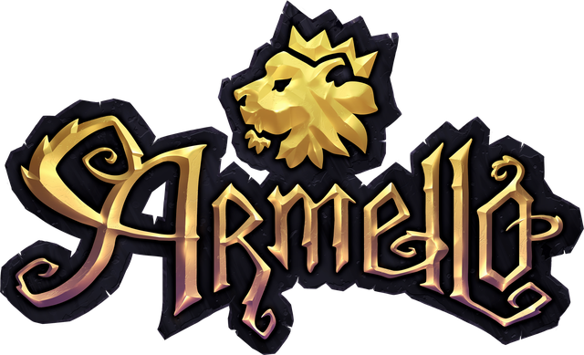
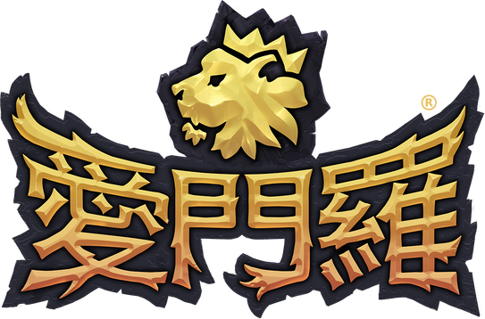
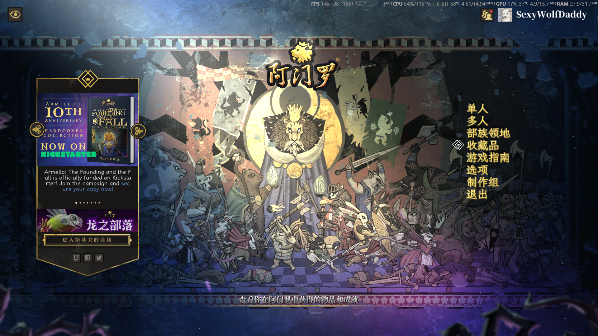
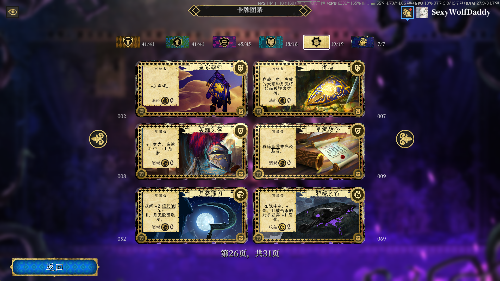
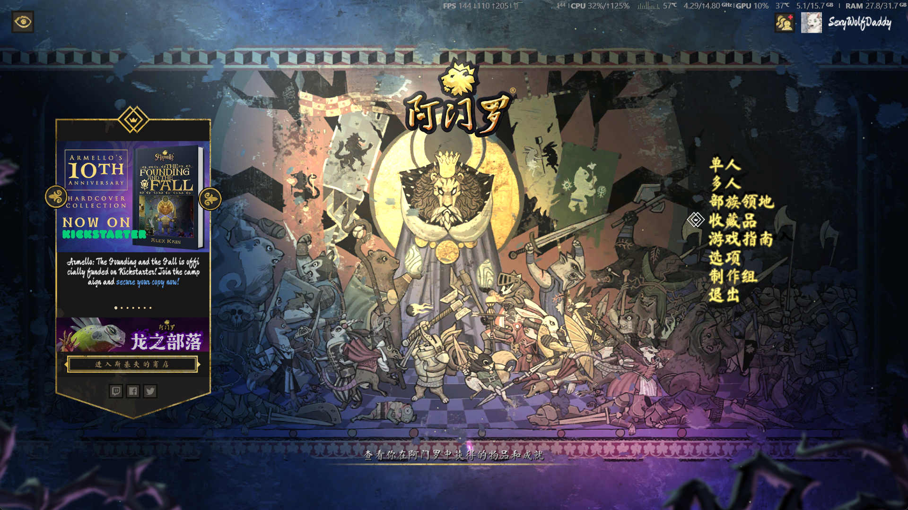
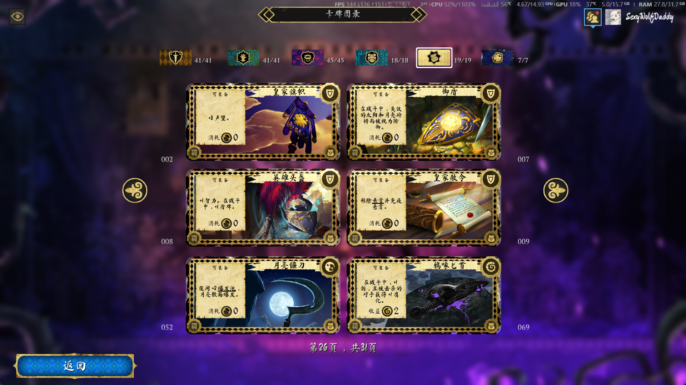

[簡體中文](README.md) · [繁體中文](README_TC.md) · [English](README_EN.md)

  
  
  

# Armello 中文本地化補丁

簡體中文 · 全量重譯 ｜ 繁體中文 · 官方譯本精修 ｜ 中文字型 · 三檔替換

 

> **Armello 簡體中文重譯補丁** 是一個非官方粉絲專案，基於官方中文的機翻問題，對遊戲內全部 10,867 條文字逐條對照英文原文重新翻譯與審校——最終由 DeepSeek Pro（思考模式）拉通原文、官中與新譯文三方綜合審查，擇優選用的 **AI 精校版文字**。
>
> 🧩 強烈建議同時安裝 [Armello Tooltip Fix](https://github.com/deserthouse/armello-tooltip-fix)：否則部分卡牌描述會觸發遊戲引擎的換行渲染 bug，外顯 `[/url]` 亂碼文字。兩者獨立安裝、互不依賴。
>
> 🚧 繁體中文精修版施工中——以官方繁中為底本、只修錯漏（術語沿用台版，如 Rot=汙穢），隨下個版本推出。

## ✨ 專案特性

### 文字品質

| 層 | 說明 |
|---|---|
| **全量覆蓋** | 10,867 條：任務劇情 / 卡牌 / 物品 / UI / 成就 / 對話 / 商店 / 教學，無一遺漏 |
| **多輪 AI 精校** | Flash 初篩 → Pro 絕對品質終審（思考模式，三方對照），約 1,500 條修改 |
| **術語權威表** | 1,192 條專名強制一致 + GLOSSARY v1.2 術語規範 + STYLE_GUIDE 風格規範 |
| **格式規範化** | 佔位符 / 引號 / 省略號 / 數字空格 / 換行符，程式化校驗全零 |
| **決策留痕** | 每條譯文攜帶完整 provenance 審計鏈，「為什麼這樣譯」全程可溯 |

### 字型工程

| 版本 | 內文 | 標題 | 主選單 |
|---|---|---|---|
| **font 版** | 霞鶩文楷 | 思源宋體 Heavy | 霞鶩文楷 |
| **artfont 版** | 馬善政毛筆楷書 | 思源宋體 Heavy | 馬善政毛筆楷書 |
| **textonly 版** | 官方原字型 | 官方原字型 | 官方原字型 |

主選單字型透過重烘焙 TMP SDF 距離場圖集實現替換（詳見 [HACKING.md](HACKING.md)），內文透過 Font 物件 TTF 內嵌替換實現。全部字型均為 OFL 開源授權。

## 📸 效果預覽

### font 版（霞鶩文楷）

> 💡 截圖中可注意到一處遊戲引擎 bug：月亮鐮刀的效果文字外顯了 `[/url]` 標籤（與字型和翻譯無關）。安裝 [Armello Tooltip Fix](https://github.com/deserthouse/armello-tooltip-fix) 即可消除。

  
  

### artfont 版（馬善政毛筆楷書）

  
  

## 🚀 安裝使用

**[📥 前往 Releases 下載最新版本](https://github.com/deserthouse/armello-chinese-localization/releases)**

三版任選其一（文字內容完全相同，區別僅在字型）：

| 版本 | 大小 | 適合 |
|---|---|---|
| **textonly** | 39.7MB | 只改文字，保持官方字型 |
| **font** | 293.9MB | 文字 + 霞鶩文楷（清爽手寫楷體） |
| **artfont** | 258.5MB | 文字 + 馬善政毛筆楷書（粗獷書法風） |

### 步驟

1. 下載壓縮包
2. Steam 庫中右鍵 Armello → 管理 → 瀏覽本地檔案 → 進入 `Armello\armello_Data\`
3. 把壓縮包內**全部內容**解壓到 `armello_Data\`，覆蓋同名檔案（`StreamingAssets` 子資料夾自動落位）
4. 啟動遊戲

> 建議覆蓋前備份原檔案。還原時把備份檔案改回原名即可。

## ❓ 常見問題

**會影響成就或連線嗎？**

不會。補丁只替換顯示文字，不修改任何遊戲邏輯與數值。

**font 版和 artfont 版有什麼區別？**

文字內容完全相同，區別僅在於字型風格——font 版內文用霞鶩文楷（清爽易讀），artfont 版用馬善政毛筆楷書（視覺衝擊力強，匹配中世紀奇幻畫風）。選你喜歡的即可，不要混裝。

**卡牌描述裡偶爾看到 `[/url]` 之類的亂碼？**

這是遊戲引擎的 tooltip 標籤跨行渲染 bug（官方版本同樣存在）。安裝 [Armello Tooltip Fix](https://github.com/deserthouse/armello-tooltip-fix) 即可修復。

**遊戲更新後補丁會失效嗎？**

可能。遊戲大版本更新後文字結構可能變化，屆時需要等本補丁適配。若更新後出現異常，先還原官方檔案。

**發現錯別字或翻譯問題？**

歡迎提 [Issue](https://github.com/deserthouse/armello-chinese-localization/issues)，註明大概位置（哪個介面/哪張卡/哪段劇情）即可。

## 🔧 給開發者

技術筆記見 [HACKING.md](HACKING.md)——包含文字定位、UnityPy 解包重打包、SDF 字型圖集替換原理等。源資料 `master.jsonl` 含全部條目及逐條決策留痕。

## 🤖 AI 使用宣告

本專案不含任何人類成分，絕大多數工作都由 **AI** 完成。文字品質因此可能存在 AI 翻譯的典型瑕疵，歡迎透過 Issue 回饋。

## 📄 版權聲明

- 《Armello》遊戲本體及其中全部原始文字、美術、音訊等素材的智慧財產權歸 **League of Geeks** 所有，本倉庫維護者對上述內容**不主張任何形式的所有權**
- 本倉庫不包含任何遊戲本體資源，僅包含社群翻譯文字與讀寫工具
- 本補丁為非商業粉絲專案，僅供已購買遊戲的玩家個人使用，禁止將遊戲文字用於商業用途或單獨再分發
- 如權利方認為本倉庫內容侵犯權益，請聯絡刪除

## ⚠️ 免責聲明

- 本補丁按「現狀」（AS IS）提供，**不附帶任何明示或默示的擔保**
- 下載、安裝或使用本補丁的一切風險由使用者自行承擔
- 本專案與 League of Geeks 及官方無任何關聯，亦不代表官方立場
- 使用本補丁即表示你已閱讀並同意上述條款
